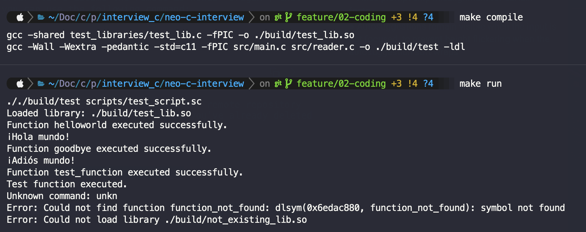

# Scripting Language Interpreter

## Description

This project implements a scripting language interpreter for testing shared function libraries in C. The application runs as a console application on the GNU/Linux OS (x86 architecture) using the POSIX.1-2001 API.

## Features

- Load shared libraries using the `use <so_name>` command.
- Call exported functions in libraries with the `call <func_name>` command.
- Handles syntax and execution errors gracefully.
- Additional support for comments (`#`, `;`) and line breaks (`\`).
- Interactive mode for direct command input from the terminal.

## Usage Example

### Running the application

```bash
./sotest test.sc
```

### Example script (test.sc)

```terminal
use ./build/test_lib.so
# this is a comment
call helloworld

call goodbye
call test_function
unkn unknow_command
call function_not_found
use ./build/not_existing_lib.so
```

### Expected output example

```bash
Loaded library: test.so
Function example executed successfully.
Function test1_func executed successfully.
Loaded library: other.so
Function func1 executed successfully.
```

## Compilation

To compile the application, run:

```bash
make compile
```

or manually:

```bash
gcc -Wall -Wextra -pedantic -std=c11 -fPIC src/main.c src/reader.c -o build/test -ldl
```

## Project Structure

```bash
.
├── Makefile              # 🛠 Script to compile and run the project
├── README.md             # 📖 Project documentation
├── build                 # 📂 Folder where compiled files are generated
│   └── test_lib.so       # 🏗 Compiled shared library
├── doc                   # 📂 Additional documentation
│   └── requirements.md
├── reader.h              # 📌 Header file for reader.c (function declarations)
├── scripts               # 📂 Contains test files
│   └── test_script.sc    # 📜 Script file with commands
├── src                   # 📂 Source code
│   ├── main.c            # 🚀 Program entry point
│   ├── reader.c          # 🏗 Logic to process scripts and load libraries
│   └── reader.h          # 🔖 Declarations for `reader.c`
└── test_libraries        # 📂 Test libraries
    └── test_lib.c        # 📚 Implementation of dynamic functions

```

## Testing & Self-Verification

Run the included test script:

```bash
make compile
make run
```

Check the console output to ensure all functions execute correctly, output should be as expected.

## Result Evidence

The following image shows the result of running the test script:



## Notes

- Syntax errors generate warnings without stopping the script execution.
- Command execution errors terminate the script execution.

## Author

Developed by juasbhu28
